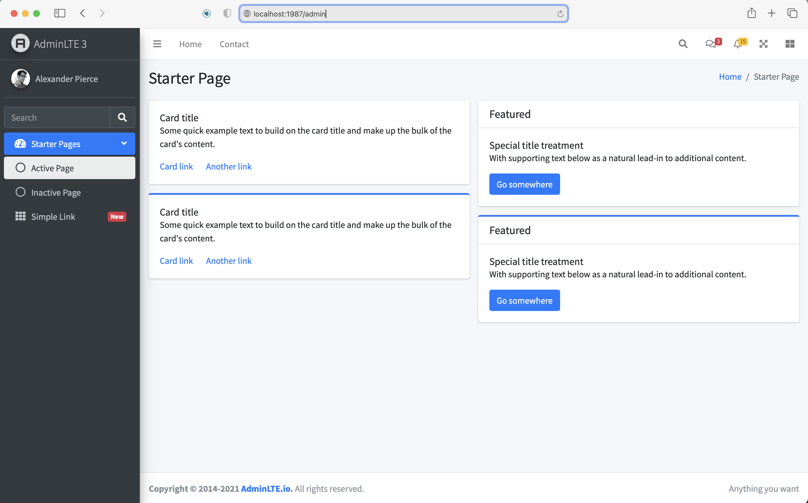
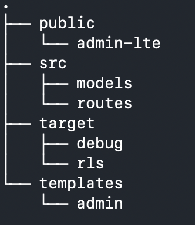

# AdminLTE - Rust

Easy AdminLTE integration with **Rust** and **tide-rs** web framework

# Setup Project

`cargo build` to install dependencies

`cargo run` to run server

Launch browser on http://127.0.0.1:1987

# Structure

**public** store public assets: css, javascript, etc

**public/admin-lte** theme of admin-lte. More information [AdminLTE v3](https://adminlte.io/themes/v3/)

**src/models** define entities or models that use

**src/routes** where to manage routing

**templates** define the html pages. This project uses [askama-rs](https://github.com/djc/askama) as an engine for rendering templates

# Note

Rust web application framework use [tide-rs](https://github.com/http-rs/tide) for rapid development

